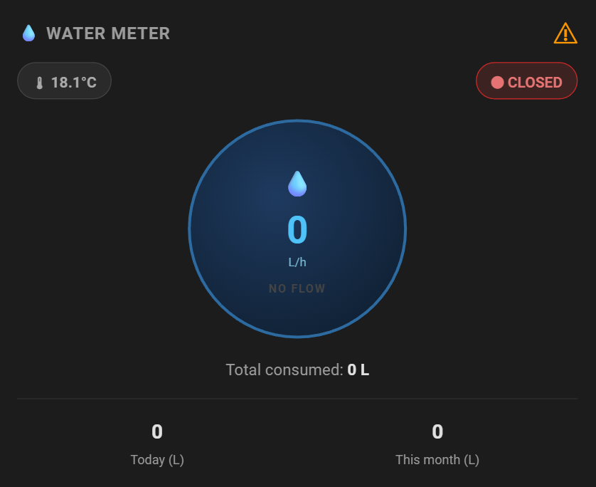

# 💧 Zemismart Water Valve & Meter — Home Assistant Dashboard Card

A styled Home Assistant dashboard card for the **Zemismart Water Valve & Meter** (zigbee water meter with built-in valve control). Displays live flow rate, temperature, valve status, consumption stats, and active fault warnings — all in a single circular instrument dial card.

> **Designed for the Home Assistant My Home → Garden dashboard tab, but works on any Lovelace dashboard.**

---

## Features

- **Circular meter face** — live flow rate in the centre, pulsing blue glow animation when water is flowing
- **Temperature badge** — shows pipe temperature; turns blue with ❄ ice warning when ≤ 4 °C
- **Valve status badge** — 🟢 green OPEN / 🔴 red CLOSED; tap to toggle via HA more-info
- **Fault warning light** — dim when clear, glowing amber ⚠ when faults are active; tap to see fault detail
- **Consumption stats** — today and this month, both tappable for 24 h history graph
- **Total consumed** — cumulative odometer display
- **Dynamic units** — reads unit_of_measurement from entity attributes; no hardcoding needed
- **HA theme aware** — uses CSS variables (`--primary-text-color`, `--secondary-text-color`, etc.)

---

## Prerequisites

| Requirement | Details |
|-------------|---------|
| Home Assistant | Any recent version with Lovelace in storage (UI) mode |
| `custom:html-template-card` | Install via HACS — [lovelace-html-template-card](https://github.com/PiotrMachowski/lovelace-html-template-card) |
| Zemismart Water Meter | Paired via Zigbee2MQTT or ZHA; entity prefix `garden_water_meter` (configurable) |

---

## Quick install

**Option A — Claude-assisted (recommended)**

With Claude and the Home Assistant MCP connected, tell Claude:

> "Help me install the Zemismart Water Valve & Meter card from https://github.com/rhamblen/zemismart-water-valve-meter — my entity prefix is `garden_water_meter`. Add it to my [dashboard name] dashboard."

**Option B — Manual**

1. Install `custom:html-template-card` via HACS
2. Download [`releases/v1.0.0/card.yaml`](releases/v1.0.0/card.yaml)
3. If your entity prefix differs from `garden_water_meter`, find-and-replace it throughout
4. Open your dashboard in edit mode → Add card → Manual card → paste the YAML → Save

Full step-by-step guide: **[INSTALLATION.md](INSTALLATION.md)**

---

## Entities used

| Entity | Role |
|--------|------|
| `sensor.{prefix}_flow_rate` | Centre dial — current flow rate |
| `sensor.{prefix}_temperature` | Temperature badge + ice warning |
| `switch.{prefix}` | Valve open/close badge |
| `sensor.{prefix}_daily_consumption` | Today stat |
| `sensor.{prefix}_month_consumption` | This month stat |
| `sensor.{prefix}_water_consumed` | Cumulative total |
| `sensor.{prefix}_faults` | Fault warning light |

Default prefix: `garden_water_meter`

Entities intentionally excluded: `switch.{prefix}_auto_clean`, `select.{prefix}_report_period`

---

## Colour reference

| Element | Normal | Alert |
|---------|--------|-------|
| Temperature badge | Grey | Blue pulse (≤ 4 °C) |
| Valve badge | Green (open) | Red (closed) |
| Fault light | Dim grey | Amber glow |
| Dial border | Dark blue | Bright cyan pulse (flowing) |

---

## Changelog

See [CHANGELOG.md](CHANGELOG.md)

---

## Licence

MIT — free to use, adapt, and share. Attribution appreciated.
